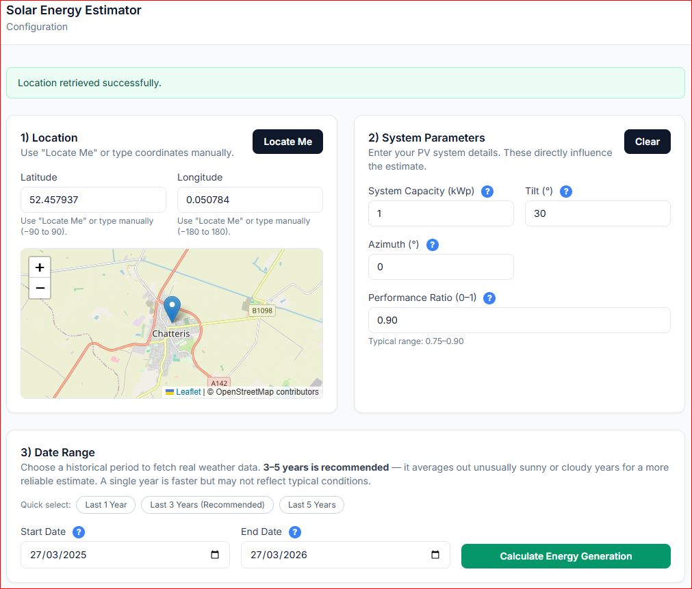
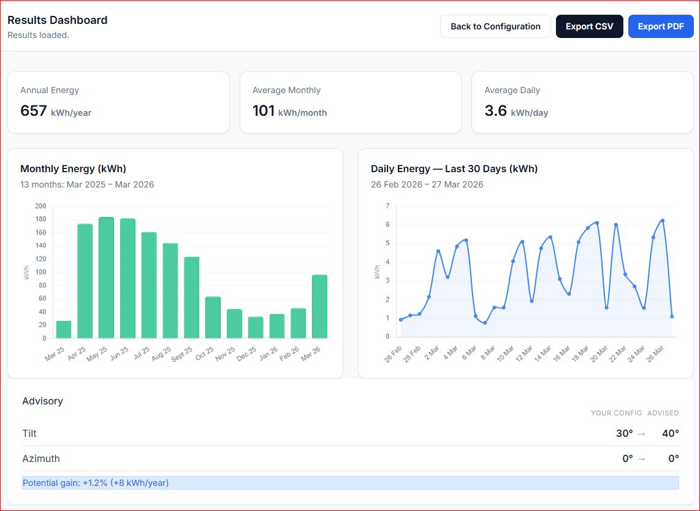

# Solar Energy Estimator

A web-based application developed as my final-year Computer Science project at Anglia Ruskin University.

The application estimates solar PV energy generation using weather data, geographic location, and configurable solar system parameters. It presents the results through an interactive dashboard and provides recommendations for improving panel orientation.

## Features

- Location detection and manual coordinate input
- Interactive map-based location display
- Historical weather data integration
- Configurable PV system capacity
- Adjustable panel tilt and azimuth
- Performance ratio configuration
- Annual, monthly, and daily energy estimates
- Interactive data visualisations
- Panel tilt and azimuth optimisation recommendations
- CSV and PDF result export

## Technologies

- HTML
- CSS
- JavaScript
- Chart.js
- Leaflet / OpenStreetMap
- Weather API integration

## How It Works

1. The user selects or detects their geographic location.
2. Solar PV system parameters are configured.
3. Historical weather data is retrieved for the selected period.
4. The application calculates estimated solar energy generation.
5. Results are displayed through daily and monthly visualisations.
6. The system evaluates the configured panel orientation and provides optimisation recommendations.

## Screenshots

### System Configuration

### Results Dashboard

## Project Background

This application was developed as my final-year BSc (Hons) Computer Science project at Anglia Ruskin University.

The project focused on creating an accessible solar energy estimation tool that allows users to understand how location, weather conditions, panel orientation, and system configuration can influence expected solar energy generation.

## Author

**Erik Spasov**

BSc (Hons) Computer Science  
Anglia Ruskin University
